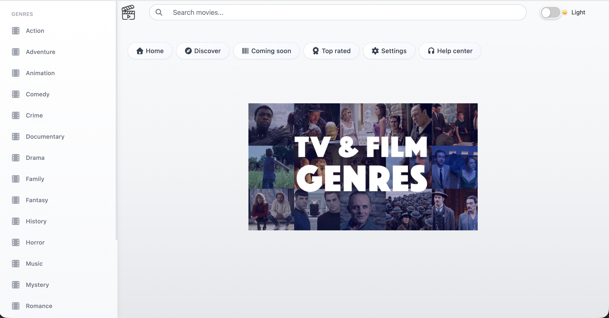
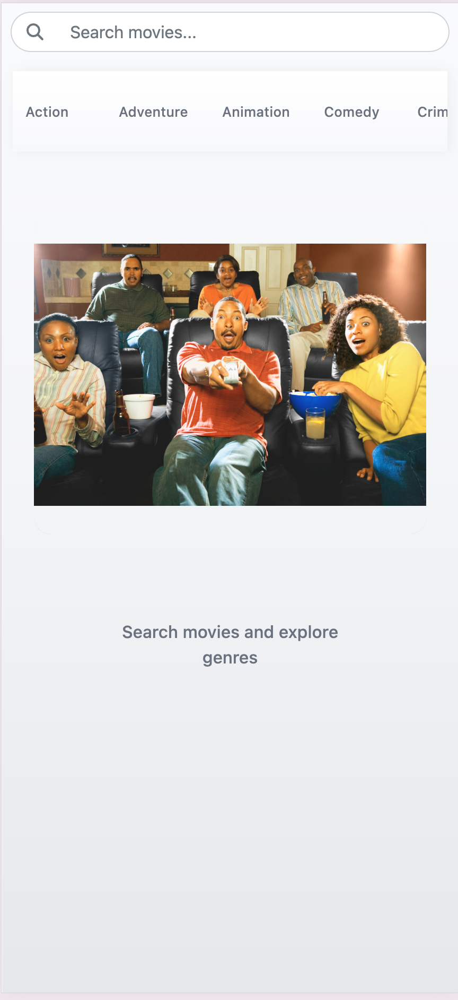
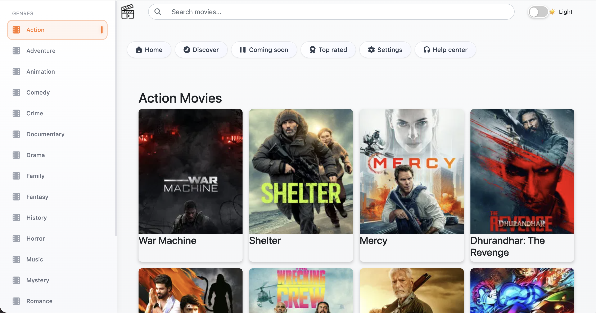
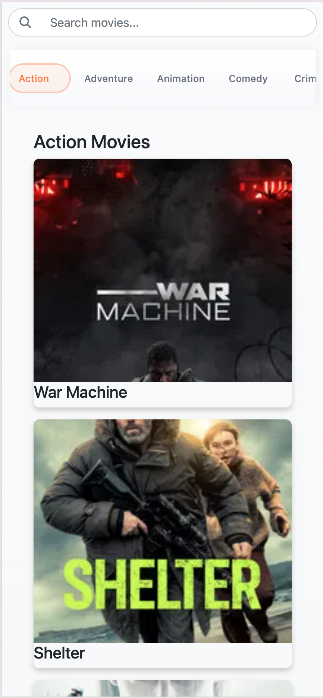
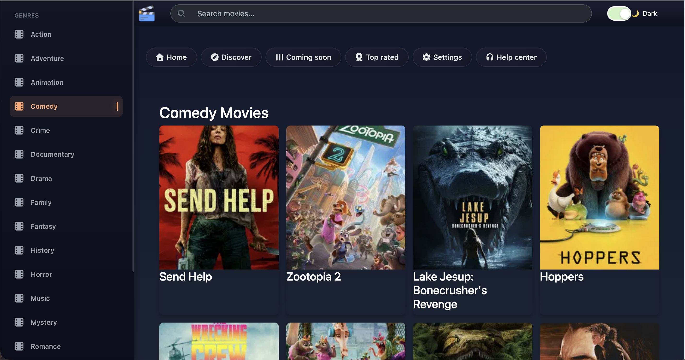
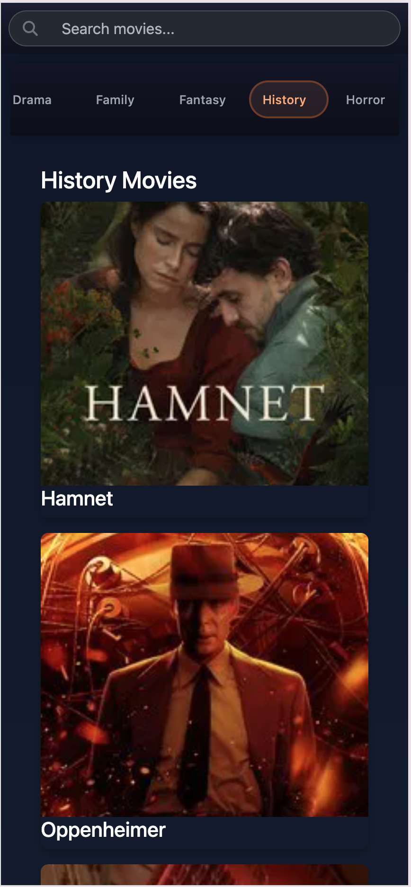
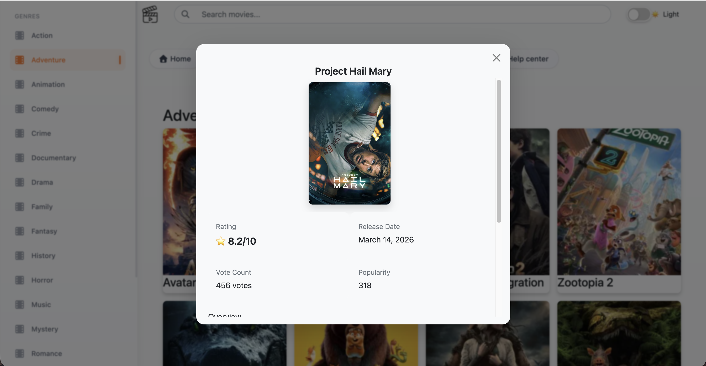
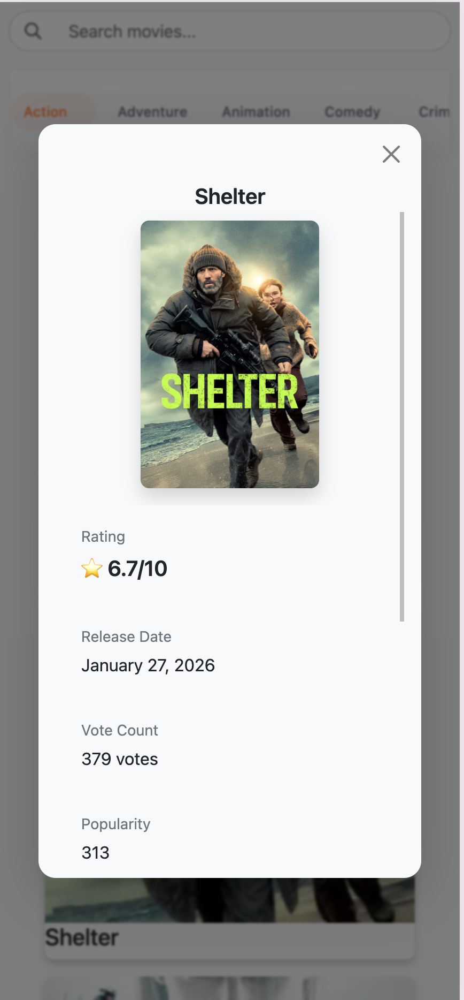
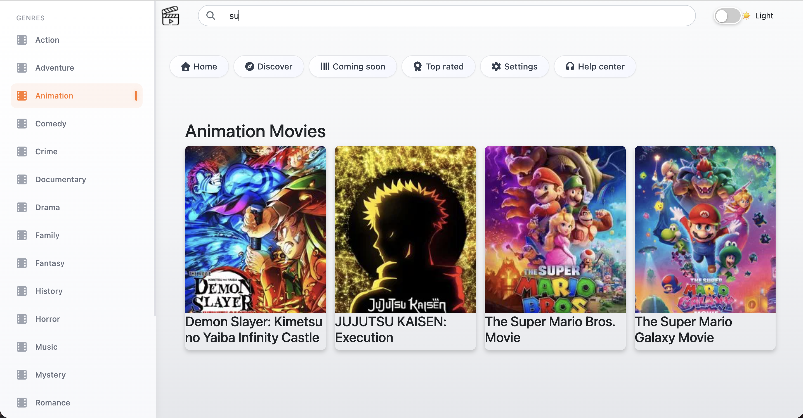
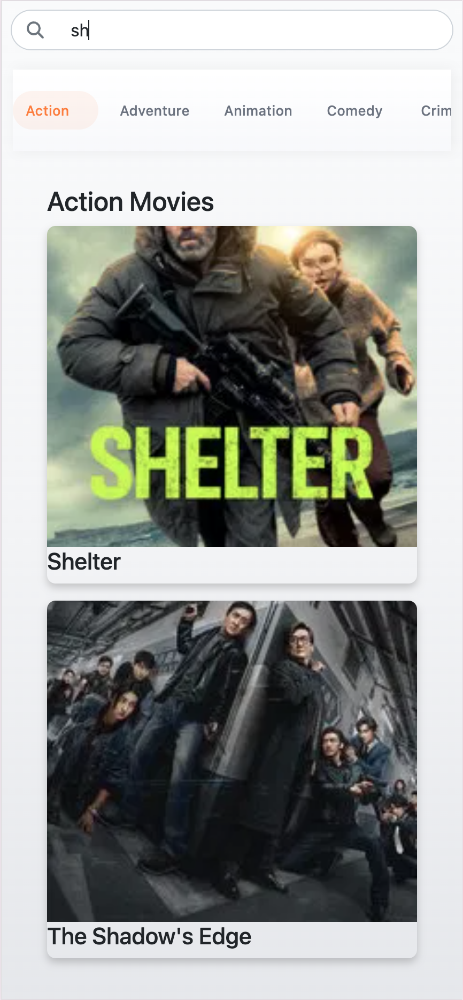

# 🍿 Movie Mania

A React + TypeScript movie browser powered by the [TMDB API](https://www.themoviedb.org/). Browse movies by genre, search by title, and view detailed information in a modal — with full light/dark mode support.

**Live Demo:** [movie-mania-production.up.railway.app](https://movie-mania-production.up.railway.app/)

## 📱 Screenshots

 ## | Desktop | Mobile |
 |  |  |
 |  |  |
 |  |  |
 |  |  |
 |  |  |


## Features

- **Browse by Genre** — Pill-style genre tags fetch movies filtered by category
- **Search** — Real-time title search within the active genre
- **Movie Modal** — Click any movie card to see its poster, overview, rating, and release date
- **Light / Dark Mode** — Toggle between themes from the navbar
- **Responsive** — Works on mobile, tablet, and desktop

## Tech Stack

| Layer | Technology |
|-------|-----------|
| UI | React 18, TypeScript |
| Styling | Bootstrap 5, CSS Modules |
| Icons | Font Awesome |
| Build | Vite |
| API | TMDB REST API |
| CI/CD | GitHub Actions |
| Registry | GitHub Container Registry (GHCR) |
| Hosting | Railway |

## Getting Started

### Prerequisites

- Node.js 18+
- A [TMDB API](https://www.themoviedb.org/settings/api) Bearer token

### Installation

```bash
git clone https://github.com/pini91/movie-mania.git
cd movie-mania
npm install
```

### Environment Variables

Create a `.env` file in the project root:

```env
VITE_AUTHENTICATION_URL="Bearer YOUR_TMDB_TOKEN_HERE"
```

> Never commit this file — it is already covered by `.gitignore`.

### Run Locally

```bash
npm run dev
```

### Build

```bash
npm run build
```

## Docker

Build and run the production image locally:

```bash
docker build \
  --build-arg VITE_AUTHENTICATION_URL="Bearer YOUR_TOKEN" \
  -t movie-mania .

docker run -p 8080:80 movie-mania
```

Open [http://localhost:8080](http://localhost:8080).

## CI/CD

### CI Pipeline (`.github/workflows/ci.yml`)

Runs on every push to `main` / `develop` and on pull requests to `main`:

1. **Lint** — ESLint
2. **Security** — `npm audit` (SCA)
3. **Test** — `npm test`
4. **Build** — Vite production build + output verification

### Docker Publish (`.github/workflows/docker-publish.yml`)

Runs on push to `main` (also triggerable manually):

1. Builds the Docker image with `VITE_AUTHENTICATION_URL` baked in at build time
2. Pushes `ghcr.io/pini91/movie-mania:latest` to GHCR
3. Triggers a Railway redeploy via the GraphQL API

#### Required GitHub Secrets

| Name | Description |
|------|-------------|
| `VITE_AUTHENTICATION_URL` | TMDB Bearer token for the Vite build |
| `RAILWAY_TOKEN` | Railway API token (Account → Tokens) |

#### Required GitHub Variables

| Name | Description |
|------|-------------|
| `RAILWAY_SERVICE_ID` | Found in the Railway service URL |
| `RAILWAY_ENVIRONMENT_ID` | Found in the Railway service URL |

## Project Structure

```
src/
├── App.tsx              # Root component — state, API calls, layout
├── Nav.tsx              # Navbar with search and dark mode toggle
├── Menu.tsx             # Side menu
├── Genres.tsx           # Genre pill tags
├── FamilyPopcorn.tsx    # Hero / banner section
├── MovieModal.tsx       # Movie detail modal
└── data/
    └── menuData.ts      # Static menu items
```

## License

MIT
